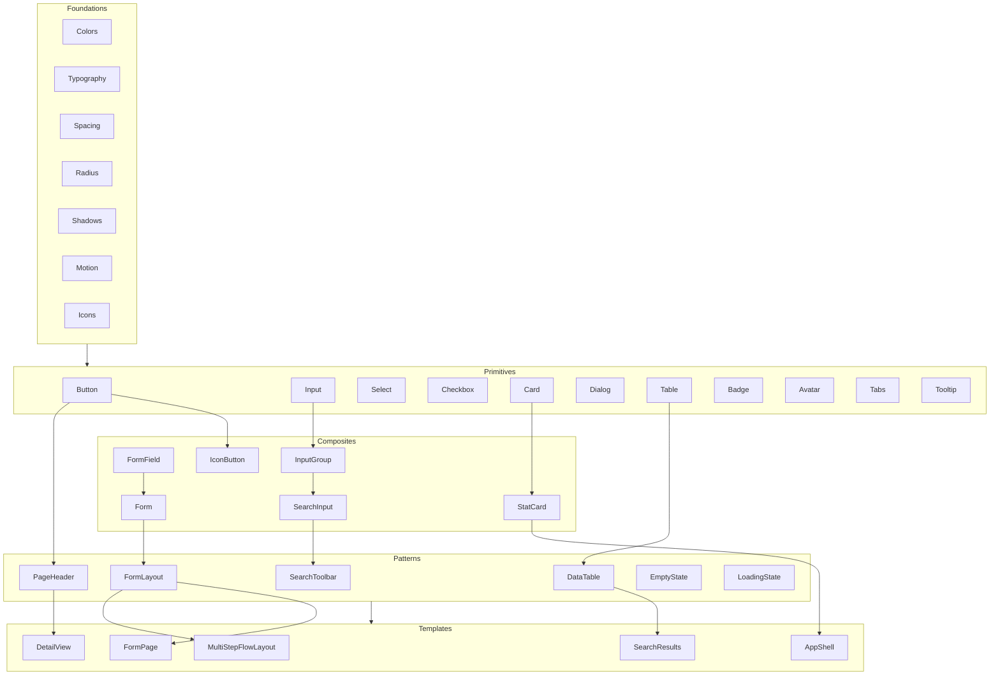

# Design System Blueprint

> **Propósito de este documento**
>
> Definir la arquitectura objetivo del Design System de Medmo.
> Responde qué existirá, cómo se relaciona, y cómo escalará durante años.
> Este blueprint es la guía para todas las decisiones de implementación futuras.

---

## Principios arquitectónicos

Estos principios gobiernan cada decisión del blueprint:

1. **El Design System es la única fuente de verdad.** Las aplicaciones consumen; nunca redefinen.
2. **Composición sobre configuración.** Componentes pequeños que se combinan, no monolitos configurables.
3. **Tokens antes que valores.** Ningún componente contiene valores hardcodeados.
4. **Accesibilidad por defecto.** No es una capa posterior; es el fundamento.
5. **Documentación viva.** MDX con componentes reales, nunca screenshots.
6. **Calm by design.** Cada capa reduce ruido visual, no lo incrementa.

---

## Separación Design Decisions / Technical Implementation

El Design System distingue dos tipos de trabajo que **nunca se mezclan**:

| Tipo | Qué es | Dónde vive | Ejemplos |
|------|--------|------------|----------|
| **Design Decisions** | Filosofía, tokens, API de componentes | `docs/`, `foundations/` | Principles, Colors, Button variants |
| **Technical Implementation** | Infraestructura del framework | `src/app/`, `src/lib/` | ThemeProvider, Tailwind `@theme`, providers |

**Regla:** Foundations define **qué valores existen**. Technical Setup define **cómo el framework los consume**. Nunca al revés.

El Design System debe poder existir independientemente del framework. `foundations/tokens/index.css` es consumible desde Next.js, Vue, Figma plugins o apps mobile.

---

## Arquitectura en capas

El Design System se organiza en 8 capas con dependencias unidireccionales:

```
┌─────────────────────────────────────────────────────┐
│                  Domain Components                   │  ← Específicos de Medmo (apps)
│         PatientCard, OrderStatusChip, etc.           │
├─────────────────────────────────────────────────────┤
│                     Templates                        │  ← Layouts de página
│    Dashboard, ListPage, DetailPage, SettingsPage    │
├─────────────────────────────────────────────────────┤
│                     Patterns                         │  ← Escenarios UX recurrentes
│   DataTable, PageHeader, EmptyState, FormLayout     │
├─────────────────────────────────────────────────────┤
│                Composite Components                  │  ← Primitivos combinados
│      FormField, InputGroup, IconButton, StatCard    │
├─────────────────────────────────────────────────────┤
│                Primitive Components                  │  ← Piezas atómicas
│         Button, Input, Select, Card, Dialog          │
├─────────────────────────────────────────────────────┤
│                   Design Tokens                      │  ← Agregación semántica
│    color-primary, spacing-4, radius-md, shadow-sm    │
├─────────────────────────────────────────────────────┤
│                    Foundations                       │  ← Lenguaje visual (framework-agnostic)
│   Colors, Typography, Spacing, Radius, Motion, etc.  │
├─────────────────────────────────────────────────────┤
│                    Principles                        │  ← Filosofía del sistema
│   Brand Language, Design Principles, Accessibility   │
└─────────────────────────────────────────────────────┘
```

**Regla de dependencia:** Una capa solo puede importar de capas inferiores. Nunca al revés.

```
Domain → Templates → Patterns → Composites → Primitives → Tokens → Foundations → Principles
```

**Estado y progreso:** Ver [000-roadmap.mdx](./000-roadmap.mdx).

---

## Arquitectura de tokens (visión completa)

El sistema de tokens evoluciona en capas. Las capas inferiores están implementadas o en progreso; las superiores están documentadas para visión de largo plazo.

```
┌─────────────────────────────────────────────────────────────┐
│  Component Tokens (futuro)                                   │
│  button-height, input-padding — definidos con Primitives     │
├─────────────────────────────────────────────────────────────┤
│  Interaction Tokens (futuro)                                 │
│  interaction-action-hover, interaction-action-disabled       │
├─────────────────────────────────────────────────────────────┤
│  Data Visualization Tokens (futuro)                          │
│  data-status-pending, data-status-escalated                  │
├─────────────────────────────────────────────────────────────┤
│  Semantic Tokens (Colors — implementado)                     │
│  color-text-primary, color-surface, color-action-primary     │
├─────────────────────────────────────────────────────────────┤
│  Primitive Tokens (Colors — implementado, interno)           │
│  primary-800, neutral-600, success-700                       │
└─────────────────────────────────────────────────────────────┘

     Density (futuro) ─── modifica valores de Spacing/Typography
                          sin cambiar componentes individuales
```

**Regla:** Cada capa consume solo la inferior. Interaction Tokens derivan de Semantic Tokens. Component Tokens derivan de Interaction + Semantic. Data Visualization Tokens son paralelos a Semantic feedback — no los reemplazan.

---

## Interaction Tokens (planificado)

**Estado:** Documentado — no implementado.

Los Interaction Tokens encapsulan el **comportamiento visual completo** de un elemento en cada estado interactivo. Viven sobre Semantic Tokens y son consumidos directamente por componentes.

| Token | Estado | Deriva de (semantic) |
|-------|--------|----------------------|
| `interaction-action-default` | Reposo | `color-action-primary` |
| `interaction-action-hover` | Hover | `color-action-primary-hover` |
| `interaction-action-pressed` | Active/pressed | `color-action-primary-active` |
| `interaction-action-disabled` | Disabled | `color-disabled-*` |

**Por qué una capa separada:** Evita que cada componente (Button, Switch, Checkbox) mapee manualmente estados → colores. Un cambio en el comportamiento de hover se aplica a todos los interactivos desde un solo lugar.

**Cuándo implementar:** Fase 4 (Primitives), al personalizar controles interactivos.

**Depende de:** Colors (semantic), Motion (duraciones de transición entre estados).

---

## Data Visualization Tokens (planificado)

**Estado:** Reservado — no implementado.

Tokens para **estados de negocio Medmo**, separados de los colores semánticos de UI (Success, Warning, Error, Info).

| Categoría | Ejemplos | Por qué no usar Success/Warning/Error |
|-----------|----------|--------------------------------------|
| Estado de orden | `data-status-pending`, `data-status-completed` | "Pending" no es warning |
| Prioridad clínica | `data-status-high-priority`, `data-status-escalated` | "Escalated" no es error |
| Flujo de trabajo | `data-status-in-progress`, `data-status-cancelled` | Significado clínico propio |

**Arquitectura:**

```
foundations/data-visualization/     (futuro)
├── statuses.ts                       Estados de negocio
├── priorities.ts                     Niveles de prioridad
├── tokens.ts                         Mapeo semántico
└── data-viz.css                      CSS custom properties
```

**Por qué separados:** Un dashboard clínico muestra simultáneamente un banner de error (UI feedback) y un badge "Escalated" (estado de negocio). Si ambos usan rojo/error, el usuario no distingue validación de formulario de urgencia clínica.

**Cuándo implementar:** Fase 6 (Patterns — DataTable) o Fase 8 (Domain Components).

**Depende de:** Colors (paleta base), posiblemente Typography (badge sizes).

---

## Density Foundation (planificado)

**Estado:** Documentado en roadmap — no implementado.

Permite definir niveles de densidad de interfaz **sin modificar componentes individuales**. El usuario o la aplicación elige un modo; los tokens de Spacing y Typography escalan proporcionalmente.

| Modo | Público | Características |
|------|---------|-----------------|
| **Comfortable** (default) | Jornadas largas, lectura extensa | Spacing generoso, body 16px, row height amplio |
| **Compact** | Dashboards densos, power users | Spacing reducido ~85%, body 14px |
| **Dense** | Tablas clínicas con muchos datos | Spacing mínimo ~70%, máxima información visible |

**Por qué existe:** Equipos médicos tienen necesidades opuestas — un médico en consulta prefiere Comfortable; un coordinador revisando 200 órdenes prefiere Dense. El DS no debe forzar una sola densidad.

**Arquitectura:**

```
foundations/density/                  (futuro)
├── modes.ts                          comfortable | compact | dense
├── scale-factors.ts                  Multiplicadores sobre spacing/type
└── density.css                       CSS variables que override tokens base
```

**Implementación:** CSS custom properties con data-attribute (`data-density="compact"`) que reasignan spacing y typography tokens. Los componentes consumen `--space-*` semánticos — nunca saben si están en comfortable o dense.

**Cuándo implementar:** Después de Spacing + Typography Foundations completadas.

**Depende de:** Spacing, Typography, posiblemente component tokens de Table/Form.

---

## Documentación de Foundations — Design Intent

Cada Foundation incluye una sección **Design Intent** al inicio de su documentación MDX. Explica por qué existe, no solo qué contiene.

**Estándar:** Ver [foundations/README.mdx](./foundations/README.mdx)

**Referencia canónica:** [colors.mdx](./foundations/colors.mdx#design-intent)

**Filosofía de motion:** Ver [motion-philosophy.mdx](./principles/motion-philosophy.mdx)

---

## Estructura de directorios objetivo

```
foundations/                          # ← Design Decisions (framework-agnostic)
├── README.md
├── colors/
│   ├── palette.ts
│   ├── primary.scale.ts
│   ├── neutral.scale.ts
│   ├── semantic.ts
│   ├── tokens.ts
│   └── colors.css
├── typography/
├── spacing/
├── radius/
├── shadows/
├── motion/
├── opacity/
├── z-index/
├── iconography/
├── breakpoints/
└── tokens/
    ├── index.css                     # Agrega todos los *.css
    ├── index.ts
    ├── contract.ts
    └── layers.ts

docs/
└── design-system/                    # ← Documentación MDX viva
    ├── 000-roadmap.mdx               # Índice maestro
    ├── inventory.mdx
    ├── blueprint.mdx
    ├── principles/                   # Filosofía (antes de tokens)
    │   ├── brand-language.mdx
    │   ├── design-principles.mdx
    │   └── accessibility.mdx
    ├── foundations/                  # Docs MDX por foundation
    │   ├── colors.mdx
    │   └── ...
    ├── components/
    ├── patterns/
    └── templates/

src/                                  # ← Technical Implementation (fase posterior)
├── app/
│   ├── layout.tsx                    # Providers (ThemeProvider, Toaster)
│   ├── globals.css                   # @import foundations/tokens/index.css
│   └── (docs)/                       # Renderizador MDX
├── components/
│   ├── ui/                           # Primitives
│   ├── composite/
│   ├── patterns/
│   └── docs/                         # Componentes de documentación
├── lib/
│   └── utils.ts                      # cn() — no redefine tokens
├── hooks/
└── templates/
```

**Nota sobre Domain Components:** Los componentes de dominio médico viven en las aplicaciones consumidoras (ej. `medmo-app/src/components/domain/`), no en el Design System. El DS provee primitivos, patterns y templates; las apps construyen domain components encima.

**Nota sobre tokens:** Los valores viven en `foundations/`. `src/` solo importa y mapea — nunca redefine.

---

## 1. Foundations — Especificación

### 1.1 Colors

Paleta derivada del color primario oficial `#242F50`.

```
Brand
├── color-primary          #242F50    Botones, links, estados activos
├── color-primary-hover    derivado   Hover de primary
├── color-primary-active   derivado   Active/pressed
└── color-primary-subtle   derivado   Backgrounds sutiles de primary

Neutral
├── color-neutral-0        #FFFFFF    Superficie más clara
├── color-neutral-50       derivado   Background secundario
├── color-neutral-100      derivado   Muted backgrounds
├── color-neutral-200      derivado   Borders
├── color-neutral-300      derivado   Borders hover
├── color-neutral-400      derivado   Placeholder text
├── color-neutral-500      derivado   Secondary text
├── color-neutral-600      derivado   Body text secondary
├── color-neutral-700      derivado   Body text
├── color-neutral-800      derivado   Headings
└── color-neutral-900      derivado   Texto principal

Semantic
├── color-success          verde      Confirmaciones, estados positivos
├── color-success-subtle   derivado   Background success
├── color-warning          ámbar     Alertas, atención requerida
├── color-warning-subtle   derivado   Background warning
├── color-error            rojo       Errores, acciones destructivas
├── color-error-subtle     derivado   Background error
├── color-info             azul       Información, tooltips
└── color-info-subtle      derivado   Background info

Surface
├── color-background       neutral-0  Fondo de página
├── color-foreground       neutral-900 Texto principal
├── color-card             neutral-0  Fondo de cards
├── color-popover            neutral-0  Fondo de popovers
├── color-muted            neutral-100 Fondos sutiles
└── color-overlay          black/40%  Overlays de modales

Interactive
├── color-border           neutral-200 Bordes default
├── color-input            neutral-200 Bordes de inputs
├── color-ring             primary    Focus rings
└── color-destructive      error      Acciones destructivas
```

**Implementación:** CSS custom properties en `:root` / `.dark`, mapeadas a Tailwind via `@theme inline`. Archivo TypeScript `colors.ts` como referencia tipada.

**Regla de uso:**
- `color-primary` crea jerarquía, no decoración
- Nunca usar primary para pintar grandes superficies
- Jerarquía tipográfica via peso y tamaño, no solo color

### 1.2 Typography

Fuente oficial: **IBM Plex Sans Condensed**

```
Font Family
├── font-body              "IBM Plex Sans Condensed", sans-serif
├── font-heading           "IBM Plex Sans Condensed", sans-serif
└── font-mono              "IBM Plex Mono", monospace (datos/código)

Font Weight
├── font-light             300
├── font-regular           400
├── font-medium            500
├── font-semibold          600
└── font-bold              700

Font Size (escala modular — ratio 1.25)
├── text-xs                0.75rem / 12px    Captions, badges
├── text-sm                0.875rem / 14px   Body small, labels
├── text-base              1rem / 16px       Body default
├── text-lg                1.125rem / 18px   Body large
├── text-xl                1.25rem / 20px    H4
├── text-2xl               1.5rem / 24px     H3
├── text-3xl               1.875rem / 30px   H2
└── text-4xl               2.25rem / 36px    H1 / Display

Line Height
├── leading-tight          1.25             Headings
├── leading-snug           1.375            Subheadings
├── leading-normal         1.5              Body
└── leading-relaxed        1.625            Long-form text

Letter Spacing
├── tracking-tight         -0.025em         Headings
├── tracking-normal         0               Body
└── tracking-wide           0.025em          Overline, caps
```

**Implementación:** `next/font/google` para IBM Plex Sans Condensed (weights 300–700). CSS variables + Tailwind theme.

### 1.3 Spacing

**Decisión global:** Grid combinado 4px + 8px.

| Regla | Valor |
|-------|-------|
| Unidad base | 4px — todos los valores son múltiplos de 4 |
| Ritmo de componentes | 8px — gaps más frecuentes entre componentes |
| Excepción | 2px hairline — focus offset, ajustes ópticos |
| Intermedios | 12, 20, 28… — precisión sin romper la grid |

**Escala primitiva oficial (interna — componentes NO consumen):**

```
spacing-2    2px     hairline / excepciones
spacing-4    4px
spacing-8    8px     ← ritmo de componente
spacing-12   12px
spacing-16   16px
spacing-20   20px
spacing-24   24px
spacing-28   28px
spacing-32   32px
spacing-36   36px
spacing-40   40px
spacing-48   48px
spacing-56   56px
spacing-64   64px
spacing-72   72px
spacing-80   80px
spacing-96   96px
```

**Arquitectura (igual que Colors y Typography):**

```
Primitives (interno)     Semantic (componentes)              Component (futuro)
─────────────────────     ─────────────────────              ──────────────────
spacing-8              →  space-inline-sm               →   button-padding
spacing-16             →  space-stack-md                    input-padding
spacing-16             →  space-card                        card-padding
spacing-8              →  space-table                       table-cell-padding
spacing-24             →  space-dialog                      dialog-padding
```

**Tokens semánticos:**

| Categoría | Tokens |
|-----------|--------|
| Inline | `space-inline-xs`, `sm`, `md`, `lg` |
| Stack | `space-stack-xs`, `sm`, `md`, `lg`, `xl` |
| Context | `space-page`, `space-section`, `space-card`, `space-form`, `space-table`, `space-dialog` |
| Extended | `space-form-label`, `space-form-group`, `space-card-gap` |

**Regla:** Componentes consumen solo `--space-*`. Nunca `--spacing-*` ni valores raw.

**Implementación:** `foundations/spacing/spacing.css`, TypeScript en `foundations/spacing/`, Tailwind mapping en Technical Setup.

### 1.4 Radius

Escala sutil — bordes discretos, no redondeados excesivos:

```
radius-none   0px
radius-sm     4px       Checkbox, badges pequeños
radius-md     6px       Inputs, buttons sm
radius-lg     8px       Buttons, cards, inputs default
radius-xl     12px      Cards grandes, modals
radius-2xl    16px      Containers especiales
radius-full   9999px    Avatars, pills
```

**Base:** `--radius: 0.5rem` (8px) — ligeramente más contenido que el actual 10px para alinear con estética Medmo (más precisa, menos redondeada).

### 1.5 Shadows

Sombras extremadamente sutiles. **No existe foundation Elevation** — la profundidad visual es regla de diseño (surfaces + borders + shadow cuando necesario), no nombre de token.

```
shadow-none   none                                    Sin sombra (default)
shadow-xs     0 1px 2px rgba(18,22,32,0.04)         Hover sutil
shadow-sm     0 1px 3px rgba(18,22,32,0.06)         Cards raised, sin ring
shadow-md     0 4px 6px rgba(18,22,32,0.06)         Popovers, dropdowns
shadow-lg     0 8px 16px rgba(18,22,32,0.08)        Dialogs, sheets
shadow-xl     0 16px 32px rgba(18,22,32,0.10)       Máximo float (raro)
```

**Regla:** Preferir jerarquía de superficies (Colors) + `ring-1 ring-foreground/10` sobre sombras. API pública: solo `shadow-*` — nunca `elevation-*`.

**Documentación:** [shadows.mdx](./foundations/shadows.mdx)

### 1.6 Motion

Animaciones funcionales — imperceptibles, nunca decorativas. **Cuatro duraciones. Tres easings. Seis presets.**

```
Durations (semantic)
├── motion-fast            100ms        Hover, focus
├── motion-moderate        150ms        Dropdown, toast
├── motion-default         200ms        Modal, toggles
└── motion-slow            300ms        Accordion height (hard cap)

Easings
├── motion-ease-out        Entradas (open, show)
├── motion-ease-in         Salidas (close, dismiss)
└── motion-ease-in-out     Estado in-place (hover, toggle)

Presets (primary API)
├── motion-hover           100ms — color/opacity/shadow only, no layout
├── motion-dropdown        150ms — fade + translateY 4px
├── motion-modal           200ms — fade + scale 0.98→1, no bounce
├── motion-toast           150ms — slide + fade
├── motion-accordion       300ms — height only
└── motion-skeleton        2s cycle — opacity breathing (only infinite allowed)
```

**Regla:** Componentes consumen `--motion-{preset}`. Interaction Philosophy (no bounce, no parallax) vive en documentación — no es API.

**Documentación:** [motion.mdx](./foundations/motion.mdx) · [motion-philosophy.mdx](./principles/motion-philosophy.mdx)

### 1.7 Icons

<!-- iconography-contract: sizes=xs,sm,md,lg,xl;default=sm;library=Lucide;stroke=2 -->

**Lucide** — biblioteca única. Cinco tamaños. Un stroke.

```
Extra compact 12px    icon-xs — metadata densa, badges
Default       16px    icon-sm — 90% del producto
Emphasis      20px    icon-md — acciones primarias, headers
Grid base     24px    icon-lg — standalone, empty state
Feature       32px    icon-xl — focal, uso raro

Stroke        2       icon-stroke — universal
Color         currentColor — hereda del padre
Gap           space-inline-xs | space-inline-sm (Spacing)
```

**Regla:** Iconos apoyan comprensión — nunca reemplazan texto clínico. Nunca decorar.

**Documentación:** [icons.mdx](./foundations/icons.mdx)

---

## 2. Design Tokens — Arquitectura de implementación

### Flujo de tokens

```
Design Decision (Figma/manual)
        ↓
CSS Custom Properties (:root / .dark)     ← Fuente de verdad runtime
        ↓
@theme inline (Tailwind v4)               ← Utilidades Tailwind
        ↓
TypeScript constants (tokens/*.ts)        ← Referencia tipada para JS
        ↓
Components (className con utilidades)     ← Consumo
```

### Convención de nombres

| Capa | Convención | Ejemplo |
|------|-----------|---------|
| CSS variable | `--{category}-{name}` | `--color-primary`, `--spacing-4` |
| Tailwind utility | `{category}-{name}` | `bg-primary`, `p-4`, `rounded-lg` |
| TypeScript | `{category}.{name}` | `colors.primary`, `spacing[4]` |

### Dark mode

- Estrategia: CSS class (`.dark`) via `next-themes`
- Todos los tokens semánticos tienen par light/dark
- Primary `#242F50` se mantiene en ambos modos (posiblemente con ajuste de luminosidad)
- Neutral scale se invierte
- Sombras se reducen en dark mode

---

## 3. Primitive Components — Catálogo objetivo

### 3.1 Componentes existentes (mantener y personalizar)

| Componente | Acción | Prioridad |
|------------|--------|-----------|
| Button | Personalizar tokens, documentar | P0 |
| Input | Personalizar tokens, documentar | P0 |
| Textarea | Unificar con Input, documentar | P0 |
| Select | Agregar fullWidth, documentar | P0 |
| Checkbox | Alinear radius, documentar | P1 |
| Radio Group | Documentar | P1 |
| Switch | Tokenizar dimensiones, documentar | P1 |
| Badge | Agregar tamaños, documentar | P1 |
| Avatar | Documentar | P1 |
| Card | Documentar | P0 |
| Table | Documentar | P0 |
| Tabs | Documentar | P1 |
| Dialog | Tokenizar overlay, documentar | P0 |
| Tooltip | Montar Provider, documentar | P1 |
| Scroll Area | Documentar | P2 |
| Separator | Documentar | P2 |
| Skeleton | Documentar | P1 |
| Spinner | Agregar tamaños, documentar | P1 |
| Sonner | Montar en layout, documentar | P1 |

### 3.2 Componentes a instalar (shadcn)

| Componente | Justificación | Prioridad |
|------------|--------------|-----------|
| Label | Requerido para forms | P0 |
| Popover | Base para Combobox, DatePicker | P0 |
| Command | Base para Combobox, search | P0 |
| Alert | Feedback inline | P0 |
| Alert Dialog | Confirmaciones | P0 |
| Combobox | Búsqueda con selección | P1 |
| Sheet | Paneles laterales | P1 |
| Sidebar | Navegación principal | P1 |
| Breadcrumb | Navegación contextual | P1 |
| Pagination | Listas paginadas | P1 |
| Progress | Procesos en curso | P2 |
| Calendar | Selección de fechas | P2 |
| Collapsible | Secciones expandibles | P2 |
| Toggle Group | Filtros multi-select | P2 |

### 3.3 Jerarquía de composición de primitivos

```
Button
├── IconButton          Button + size="icon" + aria-label
├── SplitButton         Button + DropdownMenu
└── DropdownButton      Button + DropdownMenu (trigger)

Input
├── SearchInput         Input + SearchIcon prefix
├── PasswordInput       Input + type toggle
└── (via InputGroup)    Input + prefix/suffix slot

Select
└── Combobox            Command + Popover

Checkbox
└── CheckboxGroup       Checkbox[] + fieldset

Card
├── StatCard            Card + metric display
└── (via composition)   Card + any content

Dialog
├── AlertDialog         Dialog variant con acciones fijas
└── (via Template)      ModalForm

Badge
└── StatusBadge         Badge + semantic color + icon

Avatar
├── ProviderAvatar      Avatar + online indicator
└── PatientAvatar       Avatar + initials fallback

Table
└── (via Pattern)       DataTable
```

---

## 4. Composite Components — Catálogo objetivo

| Componente | Composición | Export path |
|------------|------------|-------------|
| **FormField** | Label + Control + Description + Error | `@/components/composite/form-field` |
| **InputGroup** | Prefix slot + Input + Suffix slot | `@/components/composite/input-group` |
| **IconButton** | Button (icon size) + aria-label enforcement | `@/components/composite/icon-button` |
| **SearchInput** | InputGroup + SearchIcon + clear button | `@/components/composite/search-input` |
| **Form** | react-hook-form context + FormField[] | `@/components/composite/form` |
| **Button Group pattern** | Button[] con spacing y orden documentados | Se documenta dentro de `@/components/button` |
| **StatCard** | Card + label + value + trend | `@/components/composite/stat-card` |
| **ConfirmDialog** | AlertDialog + title + description + actions | `@/components/composite/confirm-dialog` |

**Regla:** Los composites no introducen tokens nuevos. Solo combinan primitivos existentes.

---

## 5. Patterns — Catálogo objetivo

| Pattern | Composición | Caso de uso Medmo |
|---------|------------|-------------------|
| **DataTable** | Table + TanStack Table + SortHeader + Pagination + RowSelection | Listas de pacientes, órdenes, resultados |
| **PageHeader** | Title + Description + Breadcrumb + ActionButtons | Encabezado de toda página |
| **SearchToolbar** | SearchInput + FilterButton + ViewToggle + Actions | Barra superior de listas |
| **FilterToolbar** | Select/Checkbox filters + ActiveFilterBadges + ClearAll | Filtrado avanzado |
| **FormLayout** | Form + grid de FormFields + SectionTitle + SubmitBar | Formularios de registro/edición |
| **EmptyState** | Icon + Title + Description + ActionButton | Listas vacías, sin resultados |
| **LoadingState** | Skeleton grid o Spinner overlay | Carga de datos |
| **ErrorState** | Alert (destructive) + RetryButton | Errores de fetch |
| **NotificationStack** | Sonner configurado con variants Medmo | Feedback de acciones |

**Regla:** Los patterns son stateless cuando es posible. Recibén data y callbacks via props.

---

## 6. Templates — Catálogo objetivo

Templates definen layout, slots, comportamiento responsive y orquestación genérica. No contienen copy, validaciones, rutas ni reglas de producto. Patient Registration, Deposit Flow y Study Upload viven en Products.

| Template | Estado | Patterns / componentes | Caso de uso |
|----------|--------|------------------------|-------------|
| **MultiStepFlowLayout** | Publicado | Progress + header + content regions | Flujo multi-paso genérico. Patient Intake, Provider Onboarding, Clinic Registration, Radiology Workflow, Insurance Enrollment. No es un Product ni un layout de Patients. |
| **AppShell** | Publicado | Sidebar + PageHeader + content slots | Dashboard Layout. Frame operativo. App Header, App Sidebar, Dashboard Grid y Dashboard Panel siguen siendo Components. |
| **SearchResults** | Publicado | Toolbar + Global Search Bar + results slot | Búsqueda y exploración. Extraído de Scan Search. Se compone dentro de AppShell. Sin slot de filtros: la pantalla fuente no los tiene. |
| **DetailView** | Planificado | PageHeader + Tabs + Card sections + Actions | Detalle de cualquier entidad. Bloqueado: no hay pantalla de detalle de entidad en producto. |
| **FormPage** | No extraer | — | Todos los formularios vivos son pasos de MultiStepFlowLayout. |

**Regla:** Los layouts pertenecen a Nuclear. Los products los consumen. Un layout nunca se nombra por un dominio de producto. Products solo contienen copy, validación, routing y reglas de negocio.

---

## 7. Domain Components — Directrices

Los domain components son responsabilidad de las aplicaciones consumidoras, no del Design System core.

### Qué vive en el DS vs. en la app

| En Design System | En Application |
|-----------------|----------------|
| Button, Input, Card | PatientCard |
| Badge, Avatar | OrderStatusChip |
| DataTable pattern | PatientTable (columns, filters) |
| FormLayout pattern | PatientRegistrationForm |
| ListPageLayout template | PatientsListPage |
| color-success token | "Completed" status mapping |

### Cómo construir domain components

```tsx
// ✅ Correcto — compone desde el DS
import {
  Card,
  CardAction,
  CardContent,
  CardDescription,
  CardHeader,
  CardTitle,
} from "@/components/card"
import { Badge } from "@/components/badge"

function PatientCard({ patient }: { patient: Patient }) {
  return (
    <Card>
      <CardHeader>
        <CardTitle>
          <h3>{patient.name}</h3>
        </CardTitle>
        <CardDescription>{patient.mrn}</CardDescription>
        <CardAction>
          <Badge variant="secondary">{patient.status}</Badge>
        </CardAction>
      </CardHeader>
      <CardContent>{patient.summary}</CardContent>
    </Card>
  )
}

// ❌ Incorrecto — redefine estilos del DS
function PatientCard({ patient }) {
  return (
    <div className="rounded-lg border p-4 bg-white shadow-md">
      
      <span className="text-base font-bold text-blue-900">{patient.name}</span>
    </div>
  )
}
```

---

## 8. Documentación — Arquitectura

### Sitio de documentación

Estilo shadcn/ui: minimalista, buscable, con previews interactivos.

```
docs/design-system/
├── introduction.mdx
├── principles.mdx
├── inventory.mdx              ← Inventario (este documento)
├── blueprint.mdx              ← Blueprint (este documento)
│
├── foundations/
│   ├── colors.mdx
│   ├── typography.mdx
│   ├── spacing.mdx
│   ├── radius.mdx
│   ├── shadows.mdx
│   ├── motion.mdx
│   └── icons.mdx
│
├── components/
│   ├── button.mdx
│   ├── input.mdx
│   └── ... (uno por primitivo)
│
├── patterns/
│   ├── data-table.mdx
│   ├── page-header.mdx
│   └── ...
│
├── templates/
│   ├── multi-step-flow.mdx
│   ├── dashboard-layout.mdx
│   ├── detail-view.mdx
│   ├── search-results.mdx
│   └── form-page.mdx
│
└── products/
    ├── patients/
    └── mpf-portal/                ← Mantiene `nuclear` como slug interno
```

La navegación pública del sitio utiliza cinco capas: **Foundations, Components, Patterns, Templates y Products**. Primitive y Composite Components se agrupan bajo Components; las implementaciones específicas viven bajo Products.

### Estructura de cada página de componente

Cada `.mdx` de componente sigue este orden estricto:

1. Descripción
2. Preview interactivo
3. Import
4. Uso básico
5. Variantes
6. Tamaños
7. Estados
8. Ejemplos con iconos
9. Composición
10. Accesibilidad
11. Do / Don't
12. API (prop table)
13. Código fuente

### Componentes de documentación

| Componente docs | Propósito |
|----------------|-----------|
| `<ComponentPreview>` | Renderiza el componente real con fondo neutro |
| `<CodeBlock>` | Código con syntax highlighting (shiki) |
| `<PropTable>` | Tabla de props generada desde TypeScript |
| `<DoDont>` | Side-by-side do/don't examples |
| `<FoundationScale>` | Visualización de tokens (colores, spacing, etc.) |

**Regla:** Nunca screenshots. Nunca imágenes estáticas. Solo componentes reales.

---

## 9. Relaciones entre componentes

### Diagrama de dependencias principales



### Matriz primitivo → composite → pattern

| Primitivo | Composite | Pattern | Template |
|-----------|-----------|---------|----------|
| Button | IconButton | PageHeader | DetailView |
| Button | Button Group pattern | SearchToolbar | AppShell |
| Input | InputGroup → SearchInput | SearchToolbar | SearchResults |
| Select | FormField | FilterToolbar | SearchResults |
| Checkbox | FormField | FilterToolbar | — |
| Card | StatCard | — | AppShell |
| Table | — | DataTable | SearchResults |
| Dialog | ConfirmDialog | — | — |
| Form | — | FormLayout | MultiStepFlowLayout, FormPage |
| Tabs | — | — | DetailView |
| Badge | StatusBadge | FilterToolbar | — |
| Avatar | — | — | DetailPage |
| Skeleton | — | LoadingState | Todos |
| Sonner | — | NotificationStack | Todos |

---

## 10. Convenciones de código

### Naming

| Elemento | Convención | Ejemplo |
|----------|-----------|---------|
| Component file | kebab-case | `form-field.tsx` |
| Component name | PascalCase | `FormField` |
| Token file | kebab-case | `colors.ts` |
| Token key | camelCase | `colors.primary` |
| CSS variable | kebab-case | `--color-primary` |
| data-slot | kebab-case | `data-slot="form-field"` |
| Variant prop | camelCase string union | `variant="outline"` |

### Exports

Cada capa tiene un barrel export:

```typescript
// src/components/ui/index.ts
export { Button, buttonVariants } from "./button"
export { Input } from "./input"
// ...

// src/components/composite/index.ts
export { FormField } from "./form-field"
// ...

// foundations/tokens/index.ts — public API
export { medmoContracts, medmoResolve } from "./index"
// Subpaths: @medmo/tokens/contracts | /resolve | /tooling
```

### Props

- Extender props del primitivo base (`React.ComponentProps<typeof Button>`)
- Variantes via CVA, no via className condicional manual
- Nunca aceptar `style` prop (excepto casos excepcionales documentados)
- Siempre soportar `className` para composición

### Accesibilidad

- Todo componente interactivo es keyboard-navigable
- Focus visible en todos los interactivos
- `aria-label` requerido en IconButton
- `aria-invalid` + `aria-describedby` en form controls
- Contraste mínimo WCAG AA (4.5:1 texto, 3:1 UI)
- Respetar `prefers-reduced-motion`

---

## 11. Roadmap de implementación

El roadmap completo con estado de cada fase, entregables y progreso vive en **[000-roadmap.mdx](./000-roadmap.mdx)**.

Resumen de fases:

| Fase | Nombre | Tipo | Estado |
|------|--------|------|--------|
| 0 | Audit | Design | Completado |
| 1 | Principles | Design | Completado |
| 2 | Foundations | Design | **Completado** |
| 2b | Hardening | Design | **Completado** |
| 2b | Foundations (futuro) | Design | Planificado — Density, Data Viz |
| 3 | Technical Setup | Technical | Pendiente |
| 4 | Primitives | Design + Code | Pendiente |
| 5 | Composites | Design + Code | Pendiente |
| 6 | Patterns | Design + Code | Pendiente |
| 7 | Templates | Design + Code | Pendiente |
| 8 | Domain | Application | Pendiente |

**Regla:** Fase 3 (Technical) no inicia hasta que Fase 2 (Foundations) esté 100% completa. Fase 4 (Primitives) no inicia hasta Fase 3.

---

## 12. Definición de Done (recordatorio)

Un componente solo está terminado cuando:

- [ ] Está diseñado (alineado a este blueprint)
- [ ] Está implementado (código en su capa correcta)
- [ ] Utiliza Design Tokens (cero hardcoded values)
- [ ] Es accesible (keyboard, screen reader, contrast)
- [ ] Está documentado (MDX con preview interactivo)
- [ ] Tiene ejemplos (variantes, tamaños, estados)
- [ ] Está exportado (barrel export de su capa)
- [ ] Fue revisado (consistencia con inventario y blueprint)

---

## 13. Decisiones arquitectónicas clave

| Decisión | Opción elegida | Alternativa descartada | Justificación |
|----------|---------------|----------------------|---------------|
| Headless library | Base UI | Radix UI | Ya instalado via shadcn base-nova |
| Token source of truth | CSS variables | JS-only (Style Dictionary) | Tailwind v4 consume CSS nativamente |
| Color space | oklch | hex/rgb | Mejor interpolación, Tailwind v4 nativo |
| Docs format | MDX + componentes reales | Storybook | Consistencia con shadcn model, docs vivos |
| Domain components | En apps, no en DS | En DS package | DS es agnóstico al dominio médico |
| Font loading | next/font/google | CDN link | Performance, self-hosted |
| Form library | react-hook-form + zod | Formik, custom | Ya instalado, tipado fuerte |
| Table library | TanStack Table | Custom | Ya instalado, headless |
| Icon library | Lucide | Heroicons, custom | Ya instalado, consistente |
| Dark mode | next-themes class | media query only | Control explícito, ya instalado |
| Component variants | CVA | Manual classes | Tipado, composable, ya en uso |
| Foundations location | `foundations/` en raíz | `src/lib/design-system/tokens/` | Framework-agnostic, portable |
| Principles before tokens | `docs/design-system/principles/` | Inline en blueprint | Filosofía separada y referenciable |
| Interaction Tokens | Capa sobre Semantic (planificado) | En componentes directamente | Comportamiento de estados centralizado |
| Data Viz Tokens | Separados de UI feedback (planificado) | Reutilizar Success/Error | Significado clínico ≠ feedback UI |
| Density | Foundation propia (planificado) | Props per component | Escalado global via tokens |
| Design Intent | Sección obligatoria en docs MDX | Solo documentar tokens | Explicar por qué, no solo qué |
| Motion | Filosofía antes de tokens | Animaciones libres | Movimiento funcional, reduced motion |

---

## Evolución futura: packages/foundations

### Contexto

A medida que Medmo crezca, es probable que múltiples aplicaciones consuman el Design System:

- `medmo-app` — plataforma principal
- `medmo-admin` — panel administrativo
- `medmo-docs` — sitio de documentación
- Posibles apps mobile o embeds

La pregunta es si `foundations/` debería evolucionar hacia un paquete npm independiente: `@medmo/foundations`.

### Análisis

| Criterio | `foundations/` (actual) | `packages/foundations` |
|----------|--------------------------|------------------------|
| Simplicidad inicial | Alta — un repo, sin tooling monorepo | Baja — requiere turborepo/nx/workspace |
| Framework independence | Alta — ya es agnostic | Alta — empaquetado formalmente |
| Multi-app consumption | Via import path relativo o git submodule | Via `npm install @medmo/foundations` |
| Versionado independiente | No — acoplado al repo | Sí — semver propio |
| CI/CD | Simple | Requiere publish pipeline |
| Figma sync | Manual | Publicable como npm para plugins |
| Time to first value | Inmediato | Overhead de setup |

### Ventajas de `packages/foundations`

1. **Versionado semver** — apps pueden adoptar tokens gradualmente (`@medmo/foundations@1.2.0`)
2. **Consumo multi-repo** — apps en repositorios separados instalan via npm
3. **Figma Tokens sync** — plugins consumen JSON exportado del paquete
4. **Contrato explícito** — el paquete define la API pública de tokens; cambios breaking son visibles
5. **Escalabilidad enterprise** — patrón estándar (Material, Tokens Studio, Adobe Spectrum)

### Desventajas de migrar ahora

1. **Overhead prematuro** — solo hay un consumidor (este repo)
2. **Tooling monorepo** — turborepo/pnpm workspaces añade complejidad sin beneficio inmediato
3. **Publish pipeline** — npm registry privado, CI, changelog
4. **Fricción de desarrollo** — cambiar un token requiere rebuild + publish durante Foundations

### Decisión

**Mantener `foundations/` en la raíz del repositorio actual.**

Razones:
- Estamos en fase de definición, no de distribución
- Un solo consumidor elimina la necesidad de empaquetado
- La estructura interna ya es idéntica a la de un paquete futuro
- Migrar después es mecánico si la estructura se mantiene limpia

### Criterios de migración futura

Migrar a `packages/foundations` cuando se cumplan **2 o más** de estos:

- [ ] 2+ aplicaciones en repositorios separados necesitan los tokens
- [ ] Foundations está 100% estable (sin cambios breaking frecuentes)
- [ ] Se necesita versionado semver independiente del DS
- [ ] Integración con Figma Tokens requiere paquete publicado
- [ ] El equipo crece a 5+ desarrolladores frontend

### Estructura preparada para migración

La carpeta `foundations/` se mantiene con esta estructura **compatible con npm package**:

```
foundations/
├── package.json          # ← Agregar solo al migrar
├── README.md
├── colors/
├── typography/
├── ...
└── tokens/
    ├── index.css         # Entry point CSS
    ├── index.ts          # Entry point TS
    └── index.json        # Entry point Figma (futuro)
```

Al migrar, el movimiento es:

```
foundations/  →  packages/foundations/
```

Sin reestructurar archivos internos. Solo agregar `package.json`, configurar workspace, y publicar.

---

## Regla principal

> El Design System es la única fuente de verdad.
> Las aplicaciones consumen el Design System.
> Las aplicaciones nunca redefinen el Design System.
> Si una nueva funcionalidad necesita algo nuevo, primero mejora el Design System.
> Después construye la funcionalidad.
> Nunca al revés.
